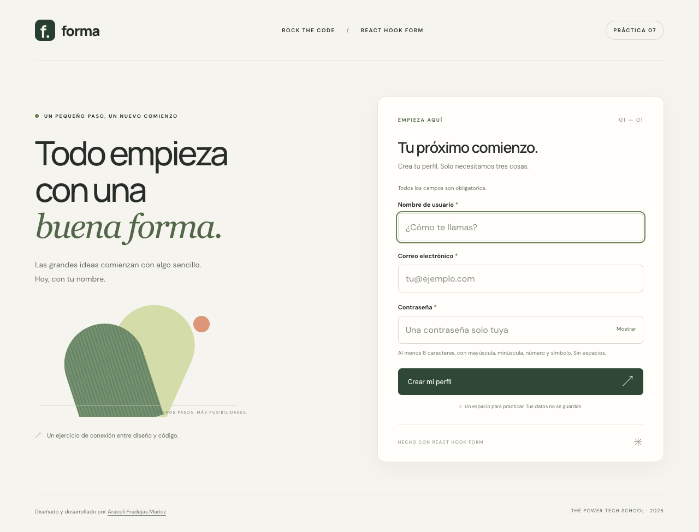
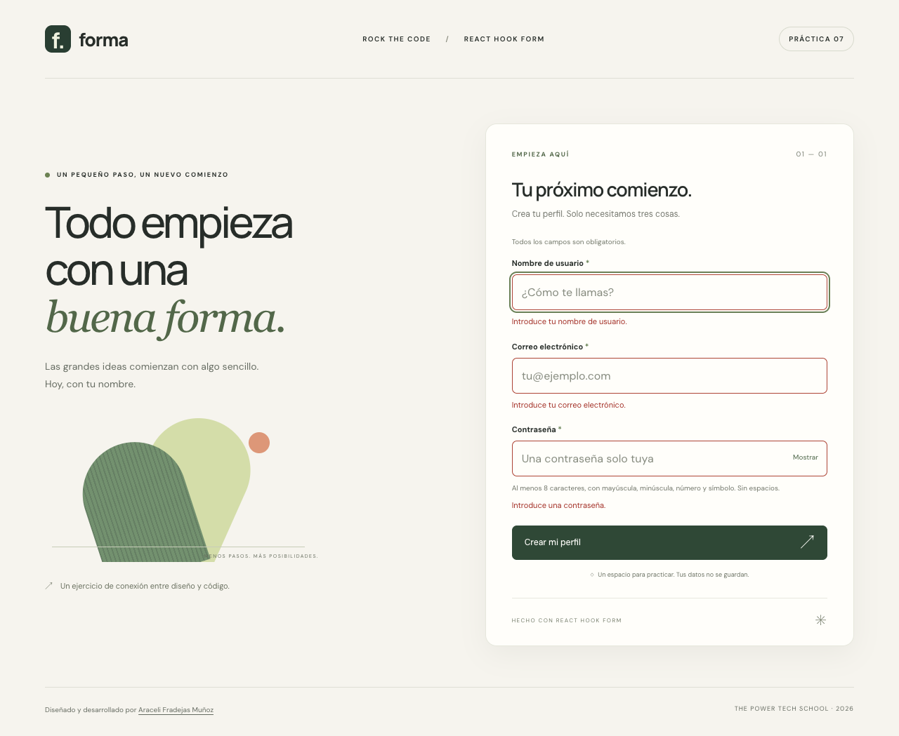
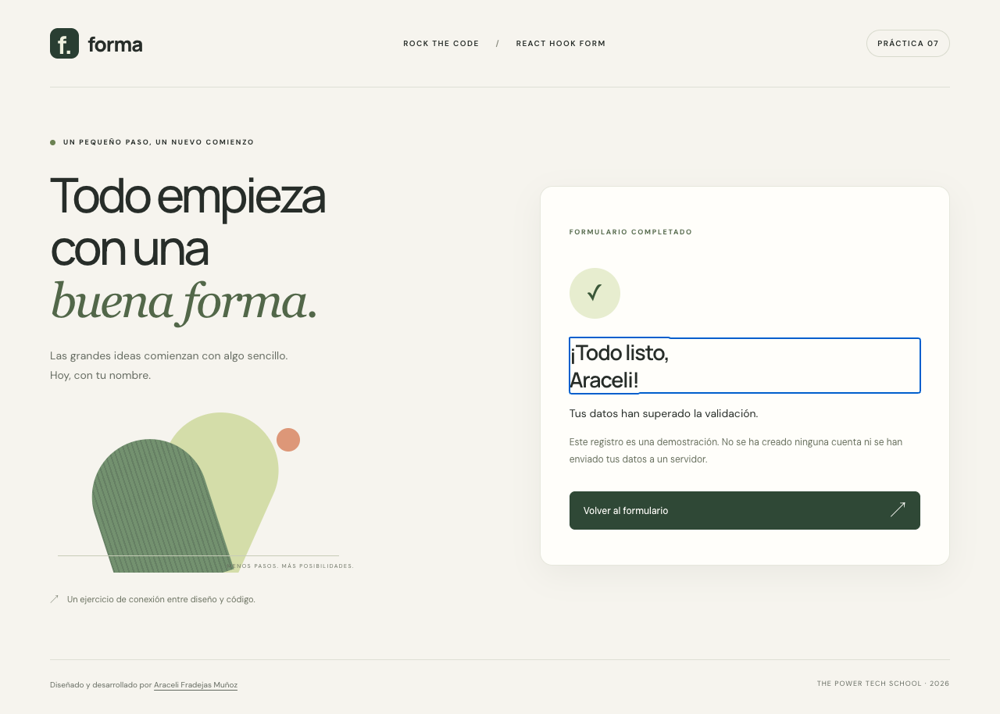
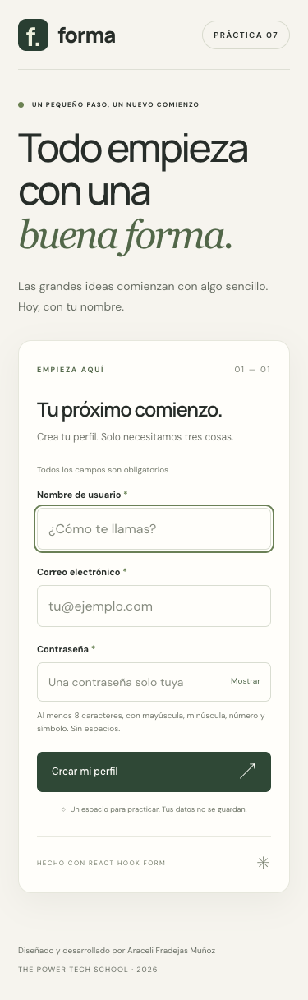

# Memoria del proyecto · React Hook Form

## 1. Resumen

En esta práctica he creado un formulario de registro para trabajar con React Hook Form. El objetivo es registrar tres campos, comprobar sus valores y mostrar mensajes útiles antes de aceptar un envío. He llamado a la propuesta visual **Forma** y he mantenido el formulario como componente independiente de la presentación general de la página.

## 2. Enunciado y requisitos

El documento de instrucciones pide un formulario de registro con maquetación libre y tres campos. No exige conexión a una API ni creación real de cuentas.

| Requisito | Implementación |
| --- | --- |
| Nombre de usuario obligatorio | `register('username', usernameRules)` con `required` y validación adicional para rechazar solo espacios |
| Correo obligatorio y patrón regex | `register('email', emailRules)` con `required` y `EMAIL_PATTERN` |
| Contraseña obligatoria y patrón regex | `register('password', passwordRules)` con `required` y `PASSWORD_PATTERN` |
| Utilizar React Hook Form | `useForm`, `register`, `handleSubmit`, `formState.errors`, `reset` y `setFocus` en `RegisterForm` |
| Maquetación libre | Diseño propio con CSS, composición de dos columnas en escritorio y una en móvil |

## 3. Cómo lo he resuelto

### Registro y envío

`useForm` inicializa los tres campos vacíos. `register` conecta cada input con sus reglas, evitando mantener un `useState` por campo. `handleSubmit` llama a `onSubmit` únicamente cuando todos los valores son válidos. El estado local de React se reserva para la visibilidad de la contraseña y el nombre de la confirmación.

El formulario usa `noValidate` para que los mensajes se gestionen de forma consistente desde React Hook Form, en lugar de mezclar avisos nativos del navegador. `mode: 'onSubmit'` muestra errores al intentar enviar; `reValidateMode: 'onChange'` permite corregirlos sin tener que pulsar el botón repetidamente.

### Reglas de validación

El correo utiliza `^[^\s@]+@[^\s@.]+(?:\.[^\s@.]+)+$`. Comprueba una estructura habitual con usuario, arroba y dominio con extensión; rechaza espacios, partes vacías y varios arrobas. Es una comprobación de formato para la práctica, no una validación exhaustiva de todos los formatos de correo ni una prueba de que la dirección existe.

La contraseña utiliza `^(?=.*[a-z])(?=.*[A-Z])(?=.*\d)(?=.*[^A-Za-z0-9\s])\S{8,}$`. Exige ocho caracteres como mínimo, letras mayúsculas y minúsculas de A a Z, un número y un símbolo, sin espacios. El enunciado pide un patrón pero no define su contenido; he elegido esta regla y la he explicado debajo del campo para que se conozca antes de enviar.

Los tres campos utilizan `required` con mensajes en castellano. El nombre añade una comprobación mediante `trim()` para impedir un valor compuesto solo por espacios. En la confirmación se eliminan los espacios de sus extremos.

### Confirmación y tratamiento de los datos

Un envío correcto muestra el nombre y un mensaje que indica que la validación ha terminado. `reset()` vacía los valores; la contraseña vuelve a estar oculta y no se copia al estado de confirmación. No hay peticiones de registro, almacenamiento persistente ni impresiones de los datos en consola. Volver al formulario permite iniciar otro registro con los campos vacíos.

### Diseño y accesibilidad

La página combina fondo cálido, tonos verdes y arcos geométricos creados con CSS. No necesita imágenes externas para la ilustración. Las fuentes se obtienen de Google Fonts y tienen alternativas locales. El formulario ocupa una tarjeta en escritorio y se sitúa debajo de la presentación en pantallas pequeñas.

Los campos tienen `label`, `aria-required` y `aria-invalid`. Los errores se relacionan con los inputs mediante `aria-describedby` y se anuncian con `role="alert"`. La ayuda de contraseña permanece asociada incluso cuando aparece un error. El botón de visibilidad es `type="button"`, tiene nombre accesible y expone su estado mediante `aria-pressed`.

React Hook Form enfoca el primer campo incorrecto. La confirmación recibe el foco al aparecer; al volver, el foco pasa al nombre. Se puede enviar pulsando Intro. El componente conserva los contornos de foco para la navegación por teclado.

## 4. Estructura final

```text
src/
  App.jsx
  App.css
  main.jsx
  index.css
  components/RegisterForm/
    RegisterForm.jsx
    RegisterForm.css
  utils/validation.js
tests/
  validation.test.js
  browser.cjs
docs/screenshots/
```

`App` organiza la cabecera, la presentación, el formulario y el pie con la autoría. Las reglas se extraen a un módulo para poder comprobarlas con Node.js. El archivo `package-lock.json` permite reproducir la instalación con `npm ci`. Se excluyen `node_modules`, `dist`, archivos de entorno y documentos Word mediante `.gitignore`, manteniendo el enunciado local como en los ejercicios anteriores.

## 5. Capturas

Formulario inicial en escritorio:



Envío vacío con los tres mensajes de obligatoriedad:



Nombre formado por espacios, correo incorrecto y contraseña que no cumple el patrón:


Confirmación después de corregir los campos y enviar:



Vista móvil a 375 píxeles:



## 6. Validación

Comprobaciones realizadas el 27 de septiembre de 2026:

- `npm test`: cinco pruebas superadas de obligatoriedad, nombre, correos válidos e inválidos y requisitos de contraseña.
- `npm run lint`: revisión de código con Oxlint terminada sin errores.
- `npm run build`: compilación de producción con Vite generada correctamente.
- `npm run test:browser`: superada en Google Chrome mediante Playwright; comprueba envío vacío, formatos incorrectos, corrección de errores, visibilidad de contraseña, envío por teclado, confirmación, limpieza y gestión del foco.
- La prueba de navegador comprueba que no se envían peticiones de registro ni se utiliza almacenamiento local o de sesión; también detecta errores de JavaScript y desbordamiento horizontal a 375 y 320 píxeles.
- Las capturas se generan desde la aplicación real con datos ficticios para documentar escritorio, errores, confirmación y móvil.
- Revisión visual de las cinco capturas, sin cortes ni solapamientos que impidan utilizar el formulario.

Para repetir las pruebas de navegador hay que instalar Google Chrome y arrancar Vite en `http://127.0.0.1:5173`, como se explica en el README. Playwright se incluye como dependencia de desarrollo.

## 7. Tecnologías y límites

React 19, React Hook Form 7, Vite 7, CSS, Oxlint, Node.js y Playwright. No hay backend, base de datos ni autenticación real. La validación cliente sirve para este ejercicio; un servicio de registro real necesitaría validación también en el servidor. La comprobación de correo no verifica su existencia. La confirmación desaparece al recargar y las fuentes externas requieren conexión, aunque la página puede usar las alternativas locales.

Referencias: [documentación de React Hook Form](https://react-hook-form.com/docs/useform), [registro y validación de campos](https://react-hook-form.com/docs/useform/register), [README de React Avanzado](https://github.com/AraceliFradejas/ejercicioES7-react-avanzado), [memoria de React Router](https://github.com/AraceliFradejas/ejerciciosES7-reactrouter/blob/main/MEMORIA.md) y [práctica de introducción a React](https://github.com/AraceliFradejas/ejerciciosES7-react).

## 8. Autora

**Araceli Fradejas Muñoz** · Proyecto académico del máster Rock The Code de [The Power Tech School](https://thepower.education/thepowermba/tech).
